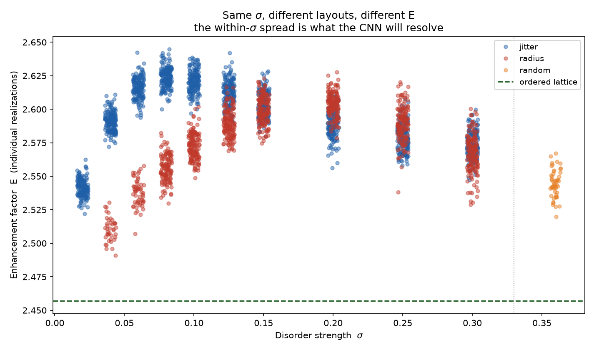
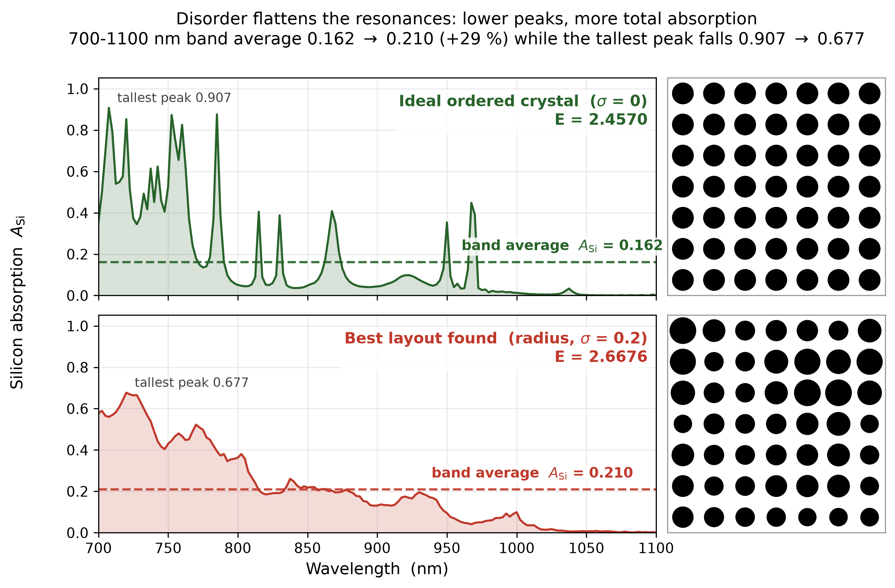
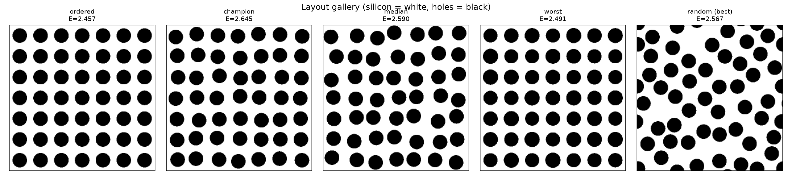
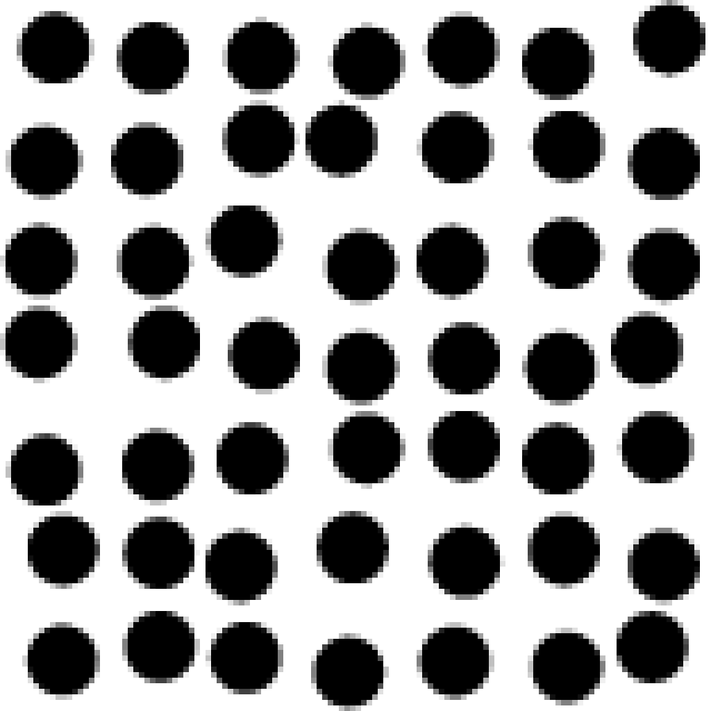
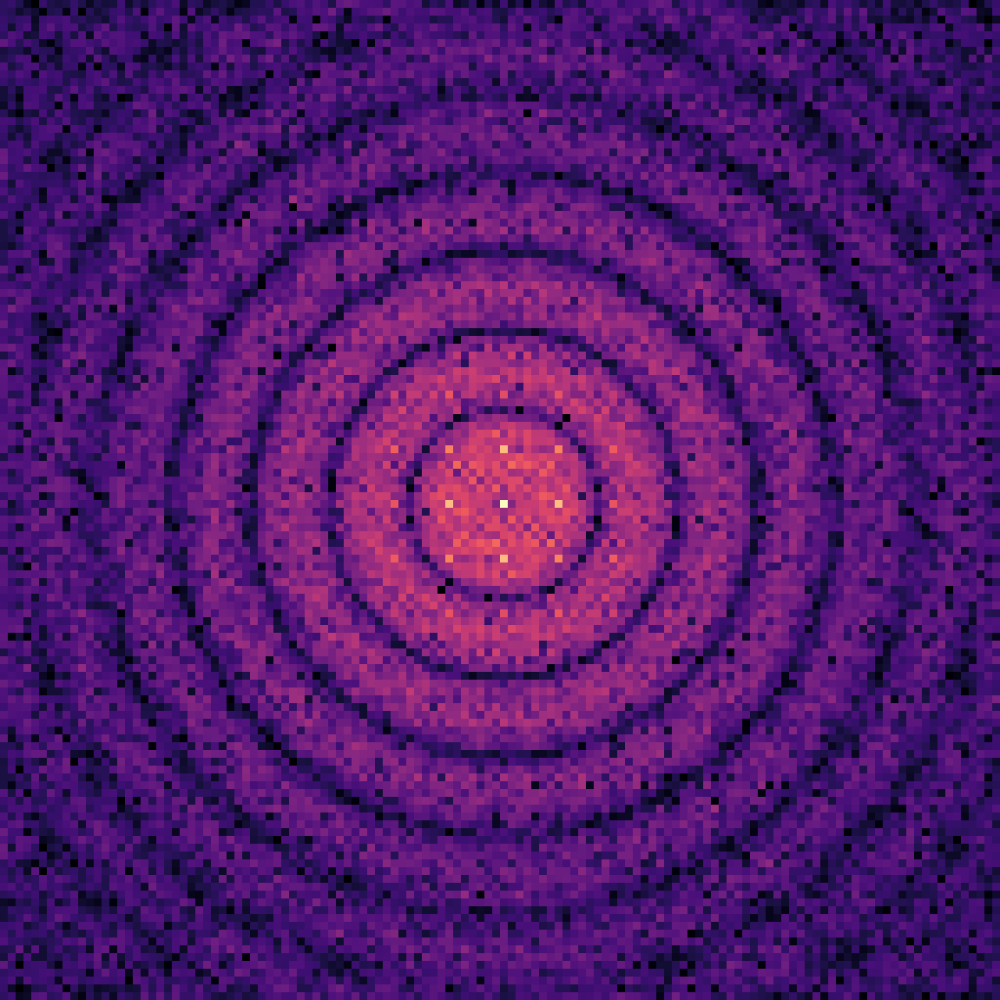
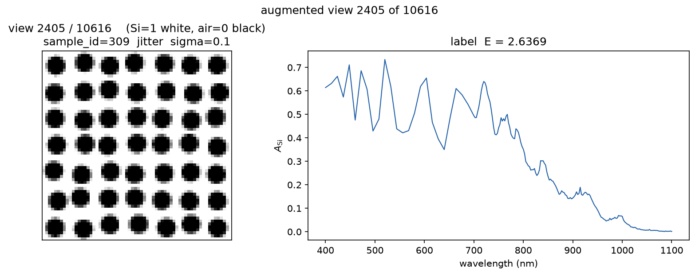
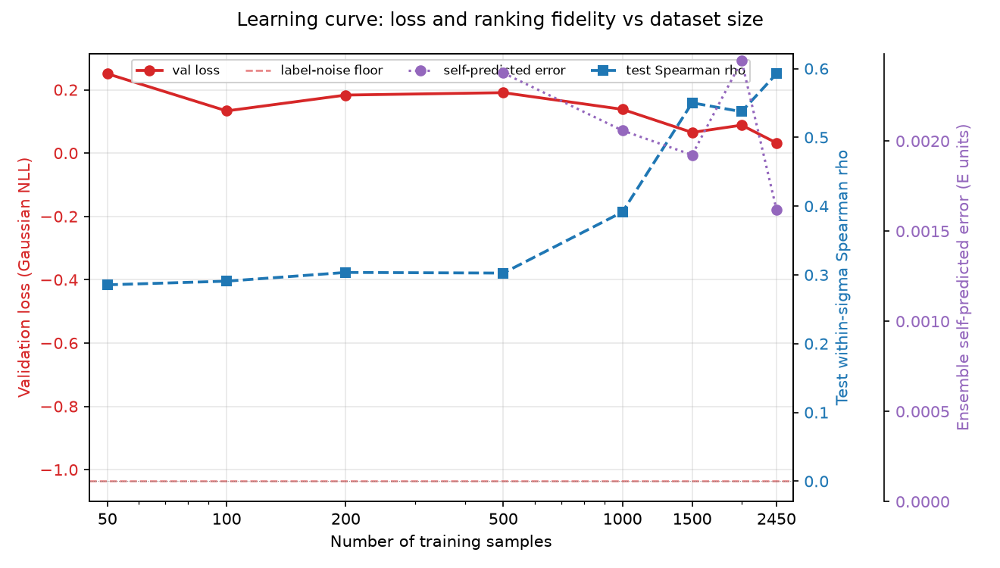
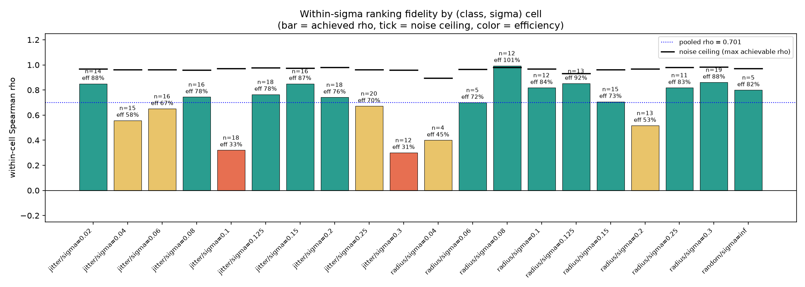
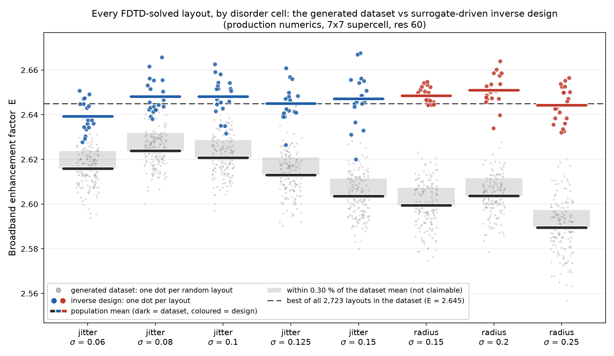

# Image gallery

Supplementary figures for SEER and the Photra-2.7k dataset. Everything
here is silicon at production numerics (res 60, a = 650 nm, r/a = 0.35,
7x7 supercell) unless a caption says otherwise.

## The dataset and the physics

### Enhancement vs disorder strength

Every FDTD-labeled layout in Photra-2.7k, plotted against its disorder
strength. Jitter (blue) and radius (red) class means both peak at an
intermediate sigma, and layouts at the same sigma spread by up to 1.6%
in E. That within-cell spread is the gap the inverse design searches.

### Why disorder wins: full-band spectra

Silicon absorption over the full 400-1100 nm range. The perfect lattice
(E = 2.457) absorbs strongly at discrete resonances with gaps between
them; the designed champion (jitter sigma = 0.15, E = 2.668) trades peak
height for broader peaks that fill the gaps, lifting the band average.

### Layout gallery

Example layouts across disorder classes and strengths, from the ordered
lattice through jitter and radius disorder to fully random placement.

## What the model sees

### Input channel 1: hole raster

The first 128x128 input channel: the rasterized hole layout, exactly as
the ensemble receives it (a jitter sigma = 0.15 sample shown, upscaled
8x for display).

### Input channel 2: structure factor

The second input channel: the same layout's structure factor
(zero-frequency centered), which hands the network the reciprocal-space
order that diffraction physics actually responds to.

### D4 augmentation

All 8 rotations and flips of one layout. Every view stays in the same
train/val/test split, so no rotated copy of a test layout leaks into
training; at inference the ensemble averages over all 8 views.

## How well it works

### Data scaling and honest uncertainty

As the training set grows, ensemble test error (red) crosses below the
0.30% ranking-resolvability floor (grey band) near N = 1,500, while
ranking fidelity rho (blue, right axis) keeps climbing. The purple curve
is the model's own error forecast, which tracks measured error to within
8% for N >= 200 and stays cautious when data is scarce.

### Ranking fidelity per cell

Within-cell Spearman correlation between predicted and true E on unseen
test layouts, per disorder class and strength. Good enough to search
with; final ordering always comes from full FDTD.

### Designed layouts vs the dataset

FDTD-verified E of the 160 inverse-designed layouts (color) against the
random-disorder dataset (grey), per cell. All 160 clear the 0.30% floor
above their cell mean; 59% beat the best of all 2,723 dataset layouts.
