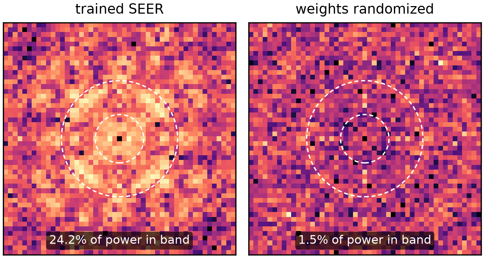

# Image gallery

Supplementary figures for SEER and the Photra-2.7k dataset. Silicon at
production numerics (res 60, a = 650 nm, r/a = 0.35, 7x7 supercell).

## Data scaling and honest uncertainty

As the training set grows, ensemble test error (red) crosses below the
0.30% ranking-resolvability floor (grey band) near N = 1,500, while
ranking fidelity rho (blue, right axis) keeps climbing. The purple curve
is the model's own error forecast, which tracks measured error to within
8% for N >= 200 and stays cautious when data is scarce.

## Ranking fidelity per cell

Within-cell Spearman correlation between predicted and true E on unseen
test layouts, per disorder class and strength. Good enough to search
with; final ordering always comes from full FDTD.

## Layout gallery

Four layouts spanning the design space, all FDTD-verified at production
numerics. Left to right: the perfect lattice; the overall design
champion (jitter, holes displaced off their lattice sites); the best
radius-class design (hole sizes varied on the lattice, statistically
tied with the champion); and a fully random layout, the
maximal-disorder end-member.

## Does the model learn the physics?

k-space power of the signed SmoothGrad saliency map on the champion
layout. The trained ensemble concentrates 24.2% of its saliency power
in the first reciprocal-lattice band (dashed circles), the spatial
frequencies that govern diffraction into guided modes. The same
architecture with randomized weights puts only 1.5% there, so the
sensitivity is learned structure and survives the standard
weight-randomization sanity check.
