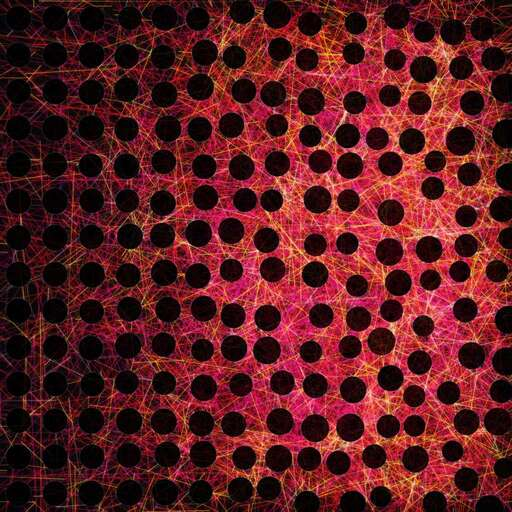

# SEER-Photonic-Design

Photonic Phenoms



SEER (Surrogate Ensemble for Enhancement Ranking): a CNN ensemble trained on electromagnetic simulations to predict and inverse-design disordered photonic-crystal thin-film solar cell layouts with enhanced solar absorption. The repo ships **Photra-2.7k**, the FDTD-labeled training dataset of 2,723 manufacturable disordered layouts.

> **Reviewing anonymously?** Use the mirror's download button to get the
> full archive. `data/samples/` holds the complete Photra-2.7k dataset as
> regular files; items stored in Git LFS (pretrained weights, prebuilt
> training tensors, raw solver outputs) appear as small pointer stubs, and
> every result below is reproducible without them via the commands in this
> README.

## Setup

### 1. Get the code

Download the repository archive and unpack it: on GitHub use
**Code → Download ZIP**, on the anonymous review mirror use the
**Download Repository** button, then `cd` into the unpacked folder.

The pretrained model weights and raw solver outputs are stored with
[Git LFS](https://git-lfs.com), so archives contain them as pointer stubs.
Nothing below requires them: the dataset in `data/samples/` ships as
regular files, and the README's commands rebuild the training tensor and
retrain the model from it. (From a git checkout, `git lfs pull` fetches
the real LFS files.)

### 2. Environment (Conda)

```bash
conda create -n seer python=3.13
conda activate seer
pip install -r requirements.txt
```

For the GPU FDTD solver, install a CUDA-enabled PyTorch build instead of the
plain pin:

```bash
pip install torch==2.13.0 --index-url https://download.pytorch.org/whl/cu130
python -c "import torch; print(torch.cuda.is_available())"   # expect True
```

### 3. Environment (uv)

```bash
uv venv --python 3.13 .venv
source .venv/bin/activate
uv pip install -r requirements.txt
```

Same CUDA note applies: swap in the cu130 index command above for GPU runs.

## Verify our results with the deployed weights

The SEER weights and the Photra-2.7k dataset ship in the repo (Git LFS), so the
surrogate metrics reported in the papers reproduce directly — no training
required:

```bash
python -m models.model \
    --eval-bundle runs/surrogate_128_fft_nll_sweep/surrogate_bundle.pt \
    --no-wandb
```

This rebuilds the exact test split from the bundle's stored training seed and
writes full diagnostics. Compare against the committed
`runs/surrogate_128_fft_nll_sweep/test_metrics.json`:

| Metric | Expected |
|---|---|
| MAE | 0.00544 |
| Within-cell Spearman rho | 0.701 |
| Calibration | see `test_metrics.json` |

To reproduce the papers' cost comparison (minutes per FDTD label vs
milliseconds per SEER evaluation) on your GPU:

```bash
PC_MODE=FULL python -u scripts/time_fdtd_vs_surrogate.py --device cuda
```

Reference numbers on one H200 (`runs/timing_fdtd_vs_surrogate.json`): 10 ms
per SEER evaluation batched, 41 ms single-layout (5 members, D4 TTA). FDTD
label time is decay-controlled and varies widely per layout; across the
2,950 logged Photra-2.7k campaign solves the median is 492 s (~8 min) with
a 200-2,800 s range, so expect the script's 3-solve median to scatter
around that.

## Running all experiments from scratch

Every stage's default input is the previous stage's default output, and all
defaults are anchored to the repo root (they work from any directory). Flags /
`PC_*` env vars override everything.

### 1. FDTD simulation campaign

Regenerate the Photra-2.7k dataset with the PyTorch FDTD solver
(one GPU solves one sample at a time):

```bash
cd scripts/FDTD_solver

# run tests/run_timing_test.py first for gates + anchors + measured ETA,
# then scope PC_SEEDS_PER_SIGMA (the cost lever) from it:
PC_MODE=FULL python -u run_dataset.py generate    # resumable; re-run to continue
PC_MODE=FULL python -u run_dataset.py plan        # progress check
PC_MODE=FULL python -u run_dataset.py analyze     # dataset.npz + labels.csv + figs
PC_MODE=FULL python -u run_dataset.py verify --top 6
```

Everything lands under `scripts/FDTD_solver/data_production/` (`PC_OUT`
default): `samples/sample_XXXXXX.npz`, `dataset.npz`, `labels.csv`,
quarantine records, logs, and figures.

Key knobs: `PC_SEEDS_PER_SIGMA` (75 default → 1551 samples),
`PC_N_RANDOM` (50), `PC_DEVICE` (`cuda`/`cpu`), `PC_PRECISION` (32/64).

### 2. Move samples into the ML bank

```bash
cp scripts/FDTD_solver/data_production/samples/*.npz data/samples/
```

`data/samples/` is the official ML-side sample bank.

### 3. Build the model dataset

```bash
python -m models.build_dataset   # data/samples → data/samples_128.npz
                                 # (128 px, FFT channel on by default)
```

### 4. Train the surrogate ensemble

Retrain the deployed configuration (five k-fold members, beta-NLL head) with
the swept hyperparameters from
`runs/surrogate_128_fft_nll_sweep/best_params.json`, into a **fresh** `-o`
output dir:

```bash
python -m models.model \
    --ensemble 5 --kfold-members --nll-head \
    --lr 5.947e-4 --weight-decay 2.132e-4 --beta-nll 0.5 \
    --dropout 0.0721 --stochastic-depth 0.0251 \
    --hidden-units 128 --batch-size 32 \
    --warmup-epochs 5 --var-warmup 10 \
    --no-wandb -o runs/my_surrogate_run
```

Ranking reproduces within the measured run-to-run noise (rho range 0.021).
(`best_params.json` also stores sweep metrics such as `combo_score`; those are
not flags.)

> **Warning:** never train into `runs/surrogate_128_fft_nll_sweep/` — that is
> the deployed bundle used for verification and inverse design.

### 5. Inverse design + FDTD verification

Design candidate layouts with the deployed (or your own) bundle, then verify
them at full numerics:

```bash
python -m models.inverse_design \
    --bundle runs/surrogate_128_fft_nll_sweep/surrogate_bundle.pt \
    --disorder-class jitter --sigma 0.10 \
    --tiers baseline screen cmaes gradient \
    --export-dir runs/inverse_v2/jitter_s010 \
    --n-baseline 5000 --n-screen 50000 --screen-keep-frac 0.2 \
    --cmaes-restarts 12 --cmaes-iters 600 --cmaes-popsize 24 \
    --grad-starts 12 --grad-steps 500 --grad-lr 0.015 \
    --kappa 0.2 --export-top 20

PC_MODE=FULL python -u scripts/FDTD_solver/verify_candidates.py \
    --in-dir runs/inverse_v2/jitter_s010
```

Outputs: `candidates/verification.csv`, `verification_verdict.json`, and
`candidates/verified_samples/` (bank-format records, sid 900000+, which feed
back into training = active learning).

For the full paper campaign across all cells (~many hours, resumable), use
the batch driver on an already-allocated GPU node:

```bash
nohup bash scripts/run_v2_campaigns.sh > v2_campaigns.log 2>&1 &
tail -f v2_campaigns.log
```

### 6. Ablations

Run the ablation suite as sequential batches (idempotent — finished steps are
skipped, partial verifications resume):

```bash
# GPU 1 (~8-12 h): every retraining ablation, then the table
nohup bash scripts/ablation/run_ablation_batch.sh retrains > abl_retrains.log 2>&1 &

# GPU 2 (~44 h): the FDTD arms (kappa0, single-member, random baseline)
nohup bash scripts/ablation/run_ablation_batch.sh fdtd > abl_fdtd.log 2>&1 &

# or everything on one GPU (~55 h):
nohup bash scripts/ablation/run_ablation_batch.sh all > abl_all.log 2>&1 &
```

Regenerate the papers' ablation tables from the results:

```bash
python scripts/ablation/ablation_table.py   # → runs/ablation/ablation_table.{csv,md}
```

### 7. Optional side branches

```bash
python -m models.learning_curve          # → runs/learning_curve_seed137_v2/
python -m models.data_augmentation       # D4 augmentation preview
python -m models.plot_aug
python scripts/interpretability/saliency.py   # → runs/interpretability/
```

## Notes

- Materials: `data/materials/*.csv` are sha256-frozen against each solver
  dir's `material_fits.json` — the solvers refuse to run on drift.
- Figures: the curated result figures live in `data/figures/` (tracked; see
  `data/figures/README.md` for what each shows and where it came from). All
  other PNGs (diagnostics under `runs/`, `scripts/FDTD_solver/data_production/figs/`,
  etc.) are regenerable outputs deliberately left untracked; git cannot
  restore them if deleted, so re-run the producing script instead of counting
  on history. Do not bulk-add them (`git add -A` would commit ~90 of them).
